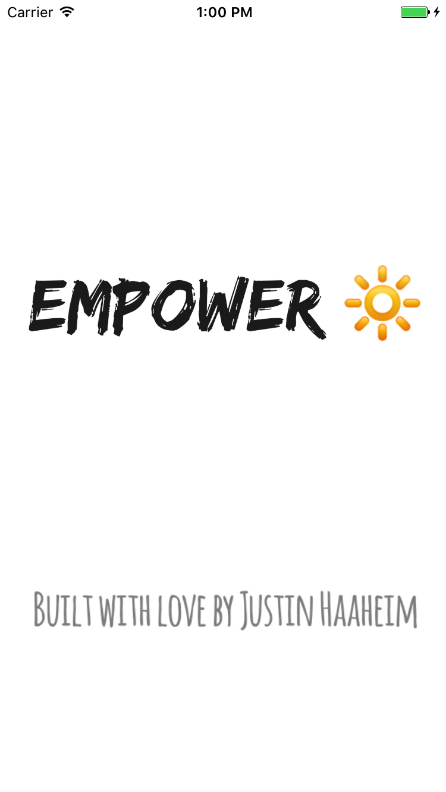
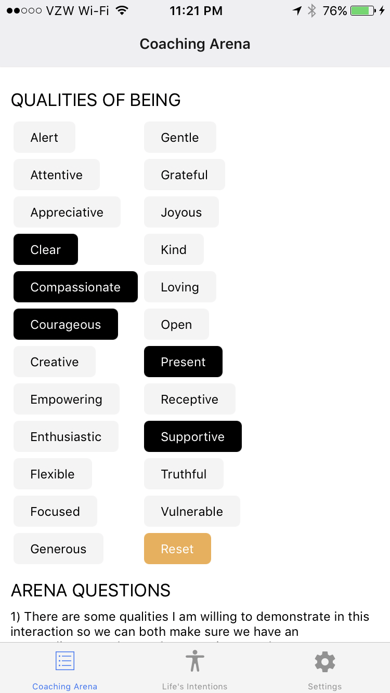

# Empower App :high_brightness:

A mobile app built in React Native + Redux that provides leadership coaching resources.

<kbd>
  
</kbd>

<kbd>
  
</kbd>

# Background

_Empower_ is a project to build and publish an iOS app in React Native + Redux that demonstrates best practices in UI design, app functionality, state management, project structure, usage of popular libraries, documentation, testing, and JavaScript code style. I tackle each of these in an incremental way, building out a few new features (and usually fixing a few new bugs) every week. See below for the [project roadmap](#project-roadmap).

The app's subject matter draws upon my [writing](http://www.huffingtonpost.com/author/justin-haaheim) and work as a [Leadership Coach](http://justinh.org/coaching). Hence: _Empower_.

The app's core functionality is a tool called the "Coaching Arena" from the [Academy for Coaching Excellence](https://acecoachtraining.com/) that coaches use with their clients everyday, so its meaning may not be entirely self-evident. Feel free to ask me about it!

I'm always glad to hear from folks. Get in touch on twitter: [@justinhaaheim](https://twitter.com/justinhaaheim) Or write me a note: `io` at `justinh` dot `org`.

-Justin 🤓

# Why am I doing this?

In July 2016 I married the woman of my dreams, Mnikesa. In addition to being a middle school English teacher and a [celebrated founder](http://www.courant.com/hometown-heroes/hc-hero-mnikesa-whitaker-20150425-story.html) of a dance program for inner-city dancers of color, "Kesa" (like Lisa with a K) suffers from a rare and life-threatening autoimmune disease called Systemic Scleroderma.

We don't know how much time we have left. For the time we _do_ have, I want to help give her the best possible life I can. I have worked as a professional leadership coach and trainer for eight years, and built two successful coaching businesses from the ground up. But when Kesa had to retire from teaching, it became clear that solo entrepreneurship was no longer the right fit for the life we want to live.

I turned to software engineering, a life-long passion. It was my vocation before becoming a coach: I have a B.A. in Computer Science and my experience includes numerous internships and professional projects. I knew that even if I wasn't up-to-date on all the latest practices and frameworks, potential employers will value my years in the workforce, my experience working with clients and managing projects, and my speed in picking things up.

That's where this project comes in. I fell in love with React because of its embrace of functional programming principles, and because of how supportive the community is. I learn best when I'm _producing_ something valuable. **Empower** is both a learning project and an app people will use. Thanks for checking it out!

# Setup

## Pre-requisites

- [node](https://nodejs.org/en/download/) and _npm_
- Globally installed [react-native-cli](https://facebook.github.io/react-native/docs/getting-started.html)
- Xcode and iOS Simulator

See [React Native: Getting Started](https://facebook.github.io/react-native/docs/getting-started.html) for help installing these dependencies

## Installation

Run the following commands:

```bash
$ git clone https://github.com/justinhaaheim/empower-app.git

$ cd empower-app

$ npm install
```

The last command can be replaced with `yarn` if you're a [yarn person](https://yarnpkg.com/en/).

## Running the app

Run the following command to compile and launch the app:

```bash
react-native run-ios
```

# Awesome React Native Resources

Along the way I have encountered some truly awesome resources/guides for learning about the different parts of the React ecosystem. Here are my favorites:

- The React [official docs](https://facebook.github.io/react/docs/hello-world.html) and [tutorial](https://facebook.github.io/react/tutorial/tutorial.html)
- The React Native [official docs](https://facebook.github.io/react-native/docs/getting-started.html) and [tutorial](https://facebook.github.io/react-native/docs/tutorial.html)
- Dan Abramov's Egghead.io courses on redux: [Part 1](https://egghead.io/courses/getting-started-with-redux) & [Part 2](https://egghead.io/courses/building-react-applications-with-idiomatic-redux).
- learncode.academy/Will Stern's youtube tutorial series on [React, Redux and MobX](https://www.youtube.com/playlist?list=PLoYCgNOIyGABj2GQSlDRjgvXtqfDxKm5b)
- Spencer Carli's [guides (Medium)](https://medium.com/@spencer_carli) and youtube [tutorials](https://www.youtube.com/channel/UC_uuod9nde9Hoea8xIVBeZQ)
- (See [here](https://www.youtube.com/playlist?list=PLjYmUByj4U1NqElgHqPbHCM-EyEFnslmY) for other awesome React videos).
- The [Pepperoni App Kit](https://github.com/futurice/pepperoni-app-kit/blob/master/docs/ARCHITECTURE.md) - a relatively mature, complete boilerplate for React Native apps
- The Jest [official docs](https://facebook.github.io/jest/)
- Alex Kotliarskyi's [React and JavaScript in 5 minutes](http://frantic.im/react-and-javascript-in-5-min)
- ["The most versatile to-do app ui kit you've ever seen"](https://www.invisionapp.com/do) (free)
- jondot's [Awesome React Native](https://github.com/jondot/awesome-react-native/blob/master/README.md) guide on GitHub

# Project Roadmap

## First steps

- [x] Install node, watchman, react-native, yarn. Figure what the heck those things actually do.
- [x] Evaluate viability/preferability of Expo development platform.
- [x] Hello world. Experiment with text layout
- [x] Use TouchableOpacity to create buttons that toggle (select and deselect)
- [x] Determine best place for application logic, and how to make use of _state_.
- [x] Hook up: buttons add and remove text to/from text field below.
- [x] Compile and test on physical device.
- [x] Add an app icon and a custom launch screen, because vanity.
- [x] Add linting using airbnb eslint preset
- [x] Create a Reset button for the list of qualities

## State Management

- [x] Implement redux for state management, using the ["Ducks"](https://github.com/erikras/ducks-modular-redux) pattern
- [x] Fresh start the project using the pepperoni-app-kit
- [x] Strip out a lot of the complexity in pepperoni
- [x] Strip out ImmutableJS -- currently causing more bugs than it is helping me avoid
- [x] Enforce throttling using `lodash.throttle` on calls to async storage which seemed to be slowing the app

## Navigation

- [x] Add a tab navigator using _react-navigation_
- [x] Add stack navigation to settings page
- [x] Create a settings page
- [x] Create setting to switch between two different versions of Arena
- [x] Add credits & acknowledgements page
- [x] Use native-base for buttons, settings page layout
- [x] Add a new screen/module for "Life's Intentions", with a settings screen to edit/update them

## Push notifications

- [x] Add local notifications using _react-native-notifications_ that fire at a specific time each Days
- [x] Add ability to schedule notifications at random times throughout the day
- [ ] Ensure only two notifications get sent each day
- [ ] Once you click on a notification, removeAllDeliveredNotifications()
- [ ] Configure notifications to open to relevant screen

## Testing

- [ ] Add snapshot tests of important components using Jest

## General dev

- [x] Upgrade to React Native 0.45
- [x] Make fresh start using React Native 0.42.3 due to bugs in 0.45 and React 16-alpha, pulling out unneeded packages from the project
- [ ] Add modal or splash screen to orient users to app's purpose
- [ ] Add google analytics
- [ ] Add fabric.io integration (or other CI/beta testing platform)
- [ ] Add CodePush to project for direct updates to users
- [ ] Update license to one that retains some rights for me

## Publish to iOS App Store

- [x] Get apple developer license
- [x] Create app archive and upload to iTunes Connect
- [x] Send out to first beta testers
- [ ] Test the app on multiple different layouts. Do necessary scaling to accommodate larger/smaller devices.
- [ ] Add more beta testers
- [ ] Ask friends/colleagues for code reviews
- [ ] Submit to Apple for app store review

## Possible extensions:

- [ ] Project: Create a second app screen/route that hosts the most recent Note from Justin, first just images, and then make it possible to display the textual note.
- [ ] Create a setting for the user to enter their first name, to customize the notes
- [ ] Create beautiful transitions and effects using the react animate library. Special button effect when tapping on a quality? Or a shake/bounce when the qualities are cleared?
- [ ] Implement a Swedish version of the app using localization
- [ ] Test and publish an Android version of the app, re-using as much of the codebase as possible.
- [ ] Add a screen to allow people to book a coaching session.
- [ ] Possibility?: develop a way that coaches can distribute this app to their clients with a special code/account that directs them to their specific coach's booking page.
