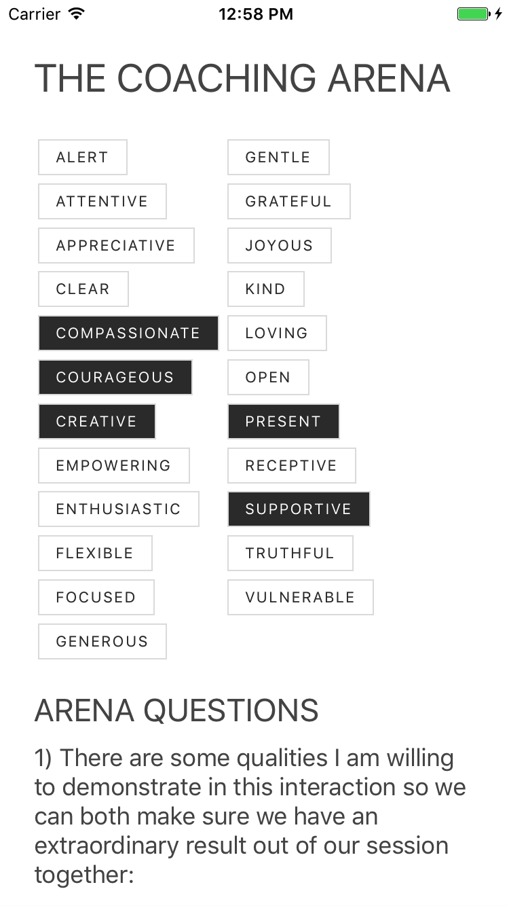

# Empower App :high_brightness:
An app that provides tools, resources and weekly notes to support you to realize your most important goals and dreams.

<kbd></kbd>&nbsp;&nbsp;&nbsp;&nbsp;&nbsp; <kbd></kbd>

&nbsp;  
&nbsp;  

## Background

This is a learning / development project, drawing inspiration from Sam Lu's fabulous [100 Days of Swift](http://samvlu.com/index.html), and Wei Fang's [30 Days of React Native](https://github.com/fangwei716/30-days-of-react-native). Each day, I will be taking the lessons, concepts, frameworks and components I encounter and turning them into features and functionalities of a working app: Empower. 

The app's subject matter draws upon my [writing](http://www.huffingtonpost.com/author/justin-haaheim) and work as a [Leadership Coach](http://justinh.org/coaching). Hence: *Empower*. 

As I go I will be collecting the most useful guides/tuturoials/reference pages I find and sharing them here.

I'm always glad to hear from folks or get pull requests. Get in touch on twitter: [@justinhaaheim](https://twitter.com/justinhaaheim) Or write me a note: `io` at `justinh` dot `org`.

-Justin 🤓  

&nbsp;  

*I am currently seeking employment. If you are a prospective employer or recruiter, don't hesitate to [get in touch](http://justinh.org/contact). You can find my full professional profile at [linkedin.com/in/justinhaaheim/](https://www.linkedin.com/in/justinhaaheim/)*

&nbsp;  

## Project Plan

#### Starting:
- [x] Install node, watchman, react-native, yarn. Figure what the heck those things actually do.
- [x] Evaluate viability/preferability of Expo development platform. 
- [x] Hello world. Experiment with text layout
- [x] Extend TouchableOpacity, drawing from F8 app button implementation, to create buttons that toggle (select and deselect)
- [x] Determine best place for the relatively simple application logic, and how to make use of *state*.
- [x] Hook up: buttons add and remove text to/from text field below.
- [x] Compile and test on physical device.
- [x] Add an app icon and a launch screen, because vanity.

#### Next up:
- [ ] Create a side "hamburger" menu
- [ ] Create an About page, and list any necessary copyrights/attributions
- [ ] Add an explanation of the arena, and the purpose of the app
- [ ] Create setting to switch between two different versions of Arena
- [ ] Implement file storage to save state between closings-openings of the app
- [ ] Create a Reset button for the list of qualities

#### Publishing:
- [ ] Initiate process to get developer license.
- [ ] Test the app on multiple different layouts. Do necessary scaling to accomodate larger/smaller devices.

#### Second Screen/Route: 
- [ ] Project: Create a second app screen/route that hosts the most recent Note from Justin, first just images, and then make it possible to display the textual note.
- [ ] Create a setting for the user to enter their first name, to customize the notes

#### Visual/animation:
- [ ] Use Shoutem or a comparable project to make the app more beautiful
- [ ] Create beautiful transitions and effects using the react animate library. Special button effect when tapping on a quality? Or a shake/bounce when the qualities are cleared?

#### Future:
- [ ] Implement a swedish version of the app using localization files
- [ ] Test and publish an Android version of the app, re-using as much of the codebase as possible.
- [ ] Implement a screen to allow people to book a session.
- [ ] Consider developing a way that coaches can distribute this app to their clients with a special code/account that directs them to their specific coach's booking page.

